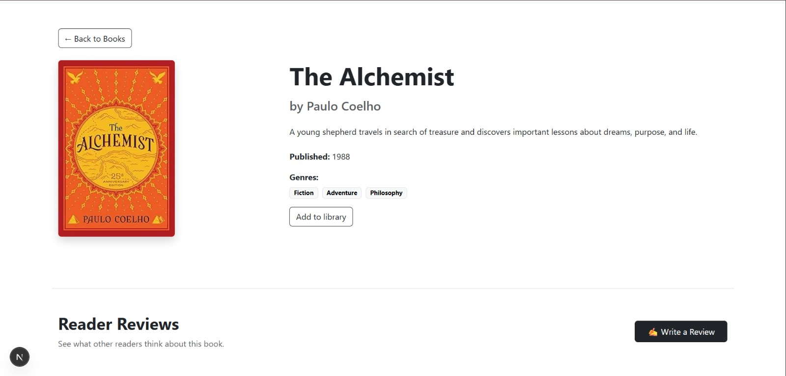
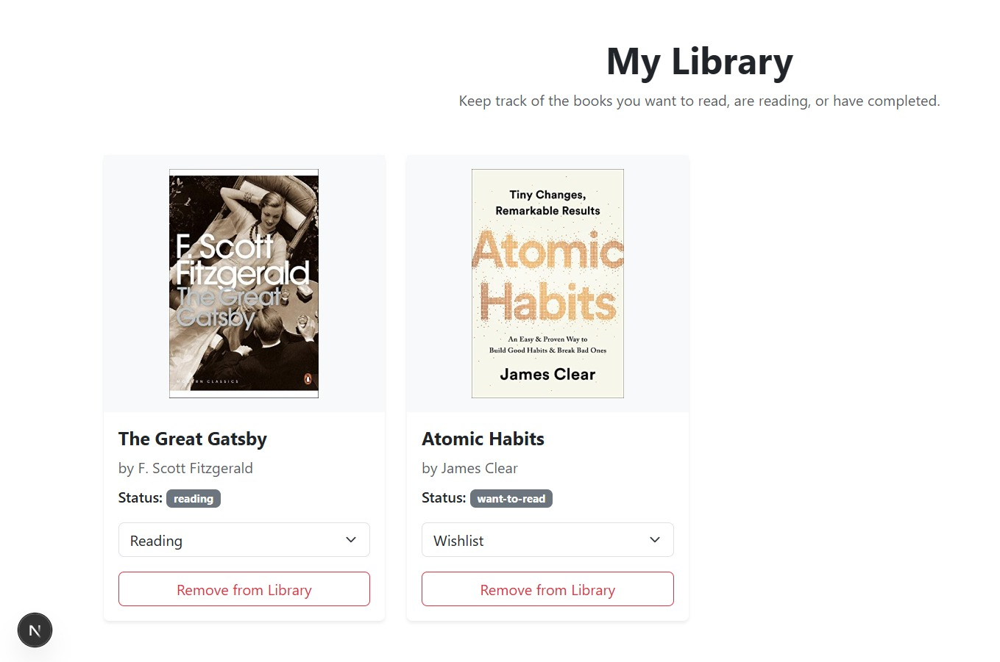
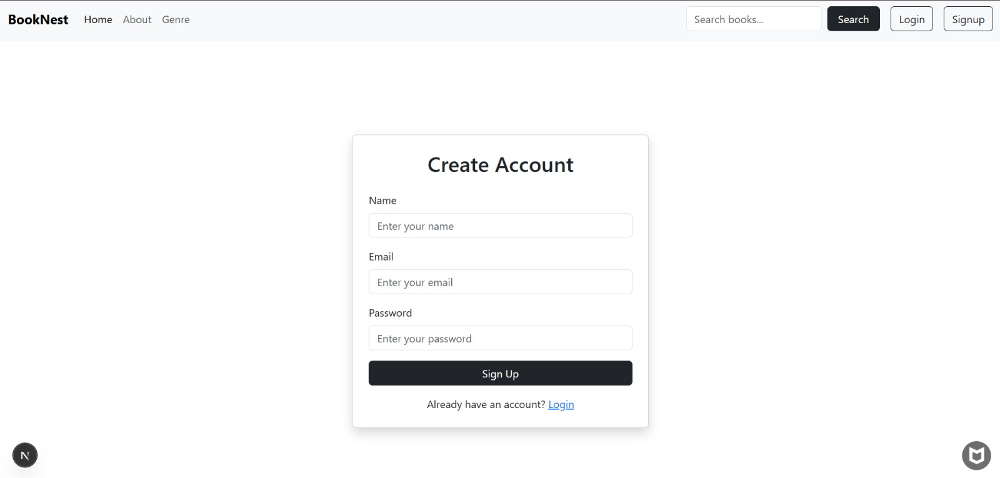

# 📚 BookNest

**BookNest** is a full-stack book discovery and personal library application that allows users to explore books, search by genre, read and submit reviews, and manage their own reading collection.

Built with **Next.js, React, Node.js, Express, and MongoDB**, BookNest provides a complete frontend and backend experience with user authentication and protected features.

---

## ✨ Features

* 📚 **Browse Books** — Explore the available book collection.
* 🔍 **Search** — Search for books by keyword.
* 🏷️ **Genre Browsing** — Discover books based on different genres.
* 📖 **Book Details** — View book information including title, author, description, genres, cover, and publication year.
* 👤 **User Authentication** — Signup and login using JWT authentication.
* ⭐ **Reviews & Ratings** — Read reviews and submit your own rating and comment.
* 📚 **Personal Library** — Add books to your personal collection.
* 📌 **Reading Status** — Organize books as **Want to Read, Reading, or Completed**.
* 🔄 **Library Management** — Update reading status or remove books from your library.
* 🔐 **Protected Actions** — Reviews and library features are available to authenticated users.

---

## 🛠️ Tech Stack

### Frontend

* Next.js
* React
* Bootstrap
* CSS Modules
* Custom CSS

### Backend

* Node.js
* Express.js
* MongoDB
* Mongoose
* JWT
* bcrypt
* CORS

---

## 🖼️ Screenshots

### 🏠 Home Page

<!-- Add your Home Page screenshot here -->


### 📖 Book Details

<!-- Add your Book Details screenshot here -->


### 📚 Personal Library

<!-- Add your Library screenshot here -->


### 🔐 Login

<!-- Add your Login screenshot here -->


---

## 📂 Project Structure

```text
BookNest/
│
├── Backend/
│   ├── config/
│   ├── controllers/
│   ├── middleware/
│   ├── model/
│   ├── routes/
│   ├── index.js
│   └── package.json
│
└── readsphere/
    ├── app/
    ├── Components/
    ├── context/
    ├── lib/
    ├── public/
    └── package.json
```

---

## ⚙️ Prerequisites

Make sure you have the following installed:

* Node.js
* npm
* MongoDB (local MongoDB or MongoDB Atlas)

---

## 🔐 Environment Variables

Create a `.env` file inside the `Backend` folder:

```env
MONGODB_URI=mongodb://localhost:27017/booknest
PORT=5000
JWT_SECRET=your_secret_key
```

> Keep your `.env` file private and do not commit it to GitHub.

---

## 🚀 Getting Started

### 1. Clone the repository

```bash
git clone <your-repository-url>
cd BookNest
```

### 2. Install frontend dependencies

```bash
cd readsphere
npm install
```

### 3. Install backend dependencies

Open another terminal:

```bash
cd Backend
npm install
```

### 4. Start the backend

```bash
node index.js
```

The backend will run on:

```text
http://localhost:5000
```

For development with automatic restarts:

```bash
npx nodemon index.js
```

### 5. Start the frontend

In another terminal:

```bash
cd readsphere
npm run dev
```

Open the application at:

```text
http://localhost:3000
```

---

## 🔮 Future Improvements

* 🤖 Personalized book recommendations
* 🛠️ Admin dashboard
* ❤️ Wishlist functionality
* 👤 Profile customization
* 📊 Reading statistics
* 🔎 Advanced filtering and sorting

---

## 📄 License

This project is licensed under the **ISC License**.
# 📚 BookNest

**BookNest** is a full-stack book discovery and personal library application that allows users to explore books, search by genre, read and submit reviews, and manage their own reading collection.

Built with **Next.js, React, Node.js, Express, and MongoDB**, BookNest provides a complete frontend and backend experience with user authentication and protected features.

---

## ✨ Features

* 📚 **Browse Books** — Explore the available book collection.
* 🔍 **Search** — Search for books by keyword.
* 🏷️ **Genre Browsing** — Discover books based on different genres.
* 📖 **Book Details** — View book information including title, author, description, genres, cover, and publication year.
* 👤 **User Authentication** — Signup and login using JWT authentication.
* ⭐ **Reviews & Ratings** — Read reviews and submit your own rating and comment.
* 📚 **Personal Library** — Add books to your personal collection.
* 📌 **Reading Status** — Organize books as **Want to Read, Reading, or Completed**.
* 🔄 **Library Management** — Update reading status or remove books from your library.
* 🔐 **Protected Actions** — Reviews and library features are available to authenticated users.

---

## 🛠️ Tech Stack

### Frontend

* Next.js
* React
* Bootstrap
* CSS Modules
* Custom CSS

### Backend

* Node.js
* Express.js
* MongoDB
* Mongoose
* JWT
* bcrypt
* CORS

---

## 🖼️ Screenshots

### 🏠 Home Page

<!-- Add your Home Page screenshot here -->

[BookNest Home Page](./screenshots/home.jpeg)

### 📖 Book Details

<!-- Add your Book Details screenshot here -->



### 📚 Personal Library

<!-- Add your Library screenshot here -->



### 🔐 Signup

<!-- Add your Login screenshot here -->



---

## 📂 Project Structure

```text
BookNest/
│
├── Backend/
│   ├── config/
│   ├── controllers/
│   ├── middleware/
│   ├── model/
│   ├── routes/
│   ├── index.js
│   └── package.json
│
└── readsphere/
    ├── app/
    ├── Components/
    ├── context/
    ├── lib/
    ├── public/
    └── package.json
```

---

## ⚙️ Prerequisites

Make sure you have the following installed:

* Node.js
* npm
* MongoDB (local MongoDB or MongoDB Atlas)

---

## 🔐 Environment Variables

Create a `.env` file inside the `Backend` folder:

```env
MONGODB_URI=your_mongodb_connection_string
PORT=5000
JWT_SECRET=your_secret_key
```

> Keep your `.env` file private and do not commit it to GitHub.

---

## 🚀 Getting Started

### 1. Clone the repository

```bash
git clone <your-repository-url>
cd BookNest
```

### 2. Install frontend dependencies

```bash
cd readsphere
npm install
```

### 3. Install backend dependencies

Open another terminal:

```bash
cd Backend
npm install
```

### 4. Start the backend

```bash
node index.js
```

The backend will run on:

```text
http://localhost:5000
```

For development with automatic restarts:

```bash
npx nodemon index.js
```

### 5. Start the frontend

In another terminal:

```bash
cd readsphere
npm run dev
```

Open the application at:

```text
http://localhost:3000
```

---

## 🔮 Future Improvements

* 🤖 Personalized book recommendations
* 🛠️ Admin dashboard
* ❤️ Wishlist functionality
* 👤 Profile customization
* 📊 Reading statistics
* 🔎 Advanced filtering and sorting

---
